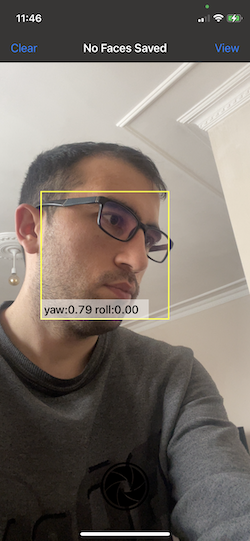
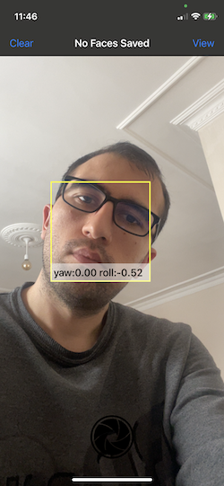

# Face Detection and Measuring Face Yaw and Roll

Using VNDetectFaceRectanglesRequest to detect face yaw and roll angle. This is modified from Apple's sample code (Selecting a Selfie Based on Capture Quality
)

## Overview

